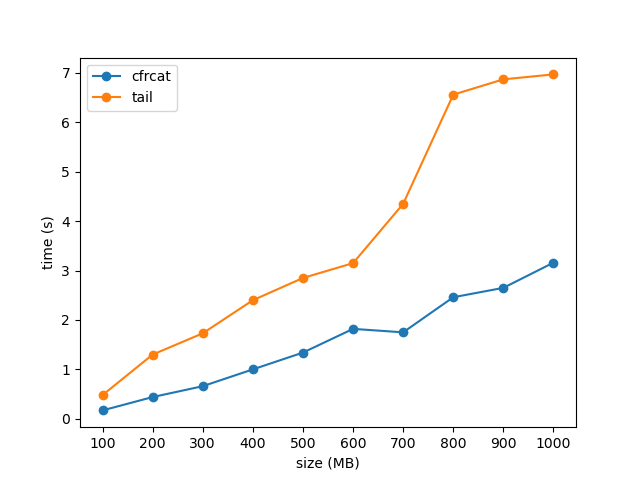

## Build

* Requires a c++17 compiler

```
mkdir build; cd build
cmake ..
make
```

## Usage

```
Concatenate FILE(s) to OUT_FILE.
Options are applied on each file.

usage:
   cfrcat -o OUT_FILE [OPTIONS]... [FILES]...

options:
   -o OUT_FILE - output path (@ for stdout but needs redirection,
                 output in fd referring to a terminal is not supported).
   -r FILE     - a header that will be added to the output.
   -l INT      - ignore the l first lines.
   -b INT      - ignore the n first bytes.
   -c INT      - ignore bytes until c (in [0, 255]) has been seen n times, need -n.
   -n INT      - see -c.
   -a          - if output file exists, append without erase.
   -d          - Display parameters.
   -h          - Display this message and exit.
   -v          - Display version information and exit.

examples:
   Concat f1 and f2 to output but ignoring two first lines in both:
      cfrcat -o output.txt -l 2 f1.txt f2.txt
   Concat f1 to output but ignoring two first bytes in f1:
      cfrcat -o output.txt -b 2 f1.txt
   Concat f1 and f2 to output but ignoring all bytes before have seen 10 'A' (65) in both:
      cfrcat -o output.txt -c 65 -n 10 f1.txt f2.txt
```

## Benchmarks

Concatenate random1.bin, random2.bin and random3.bin to output.bin and skip the first 10 lines of each file. Files have the same size, which varies from 100 to 1000 MB.

```bash
cfrcat -o output.bin -l 10 random1.bin random2.bin random3.bin
```
VS
```bash
ls random* | xargs -I{} tail -n+10 {} > output.bin
```
